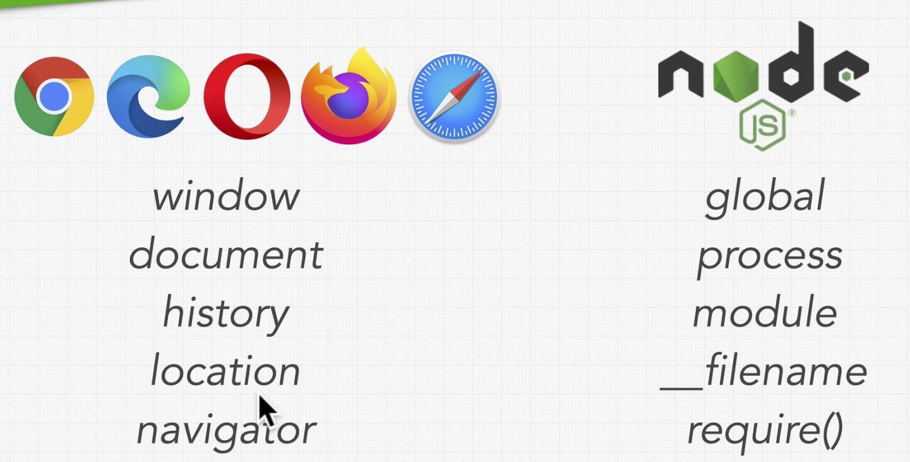
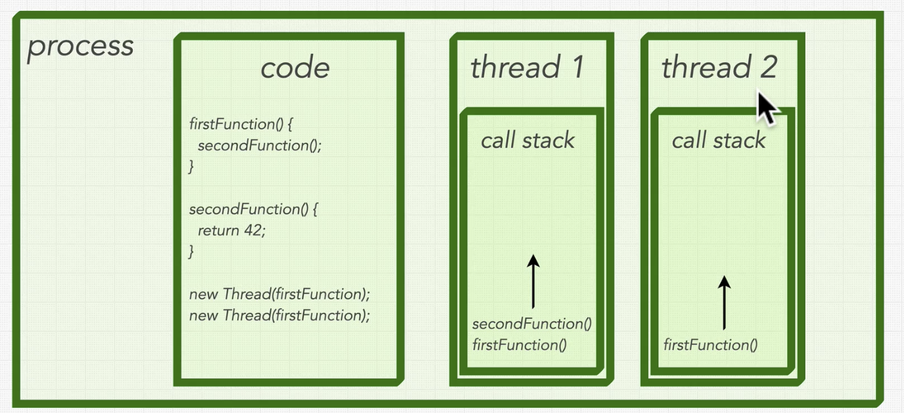

# Complete NodeJS Developer in 2022

[Udemy Course](https://www.udemy.com/course/complete-nodejs-developer-zero-to-mastery/)

---

## Node Introduction

### How it was born

JavaScript is a programming language. In order to **run JS**, we need a way to make the computer understand it. This is what a **JS Engine** does. The browser that we use has an engine to read JS. But, how do you run JS without the **browser**?

When Chrome was introduced, it came with the **V8 JS engine**. With this, _Node_ Was created with the idea of using that V8 engine outside the browser.

### Node Runtime

What Node JS Does, is to take a JS file, pass it to the V8 Engine, and when the engine sees something is not part of JS (Read files, connect to a DB, etc.), is going to communicate with the **libuv library** (support library with a focus on asynchronous I/O).

**Node is** a JS Runtime environment for us to run JS that gives us more than a V8 engine.

A clear example if this is the **Window object** in the browser. This is NOT part of JS, so the browser sends it to the V8 engine. With this you can use the print() function, alert(), get the current url, etc.
This Object is **NOT accessible** inside NODE. This are APIs.
**NODE** has their own APIs.

---

## Node JS Fundamentals

### Node vs. JS

These are some different objects NODE and web browsers can provide you:



&nbsp;

One of the Node APIs is the **global object**. This object has a lot of properties and methods.

This object provides you other main objects, such as **console**, require(), process, **dirname, **filename, etc.

```js
console.log("Hello World");
// This is actually from:
global.console.log("Hello World");
```

&nbsp;

### Synchronous vs. Asynchronous

**Syncronous** is when you wait for the code to finish before you can move on. It is processing line by line.
On the other hand, **asynchronous** is when the code does NOT run line by line. It is handling the things side by side.

&nbsp;

### Asynchronous Callbacks

Lets make a simple example of an asynchronous callback.

```js
setTimeout(() => {
  console.log("This line is first");
}, 2000);

console.log("This line is second");
```

The console will log in this order:

```
~$ node hello.js
This line is second
This line is first
```

&nbsp;

### Multi-Threading, Processes, and Threads

When you Run a **process** in your machine, you will have **containers**. These containers contain your code to run, which lives in the memory of that process. The process is able to create new **threats** to run in the background. This means that it can take advantage of the CPU in order to run code ASYNCHRONOUSLY.



Basically, we have processes. inside them they have **threads**, and they have **stacks**. The stack is where the instructions are running. Between the threads, they don't share the stacks. This is why they can **run multiple** things at the same time.

At the Hardware level, it depends on the **core CPU**. Each core is capable of running **one single thread**. If you have a core with 8 threads, you can run 8 processes at the same time. How fast they are running depends on the core's speed.

**JS is single threaded**. It is running one line at the time.

&nbsp;

### Is Node.js Multi-Threaded?

In Node we have **One single thread**. It runs the JavaScript V8 Engine on it, as well as the libuv library.

But, because libuv is written in C, it is possible to run with **multi-thread**, but not all the operating systems allows that, so it is not likely to happen like this. So, libuv also uses the **operating system** to run some threads.

All the processes that happens in libuv are inside the **Event loop**. This code allows us to run the code asynchronously, and responding the correct callback when the code is done.

So, this is why **Node is a very powerful tool**. It is written in a single thread language, but it manages to run the code asynchronously without our need to write that thread type of code.

&nbsp;

### The Event Loop

So, the event loop is a while loop. It will run all over again if it should exit or not.

```js
while (!shouldExit) {
  processEvents();
}
```

### Phases of the Event Loop

&nbsp;
