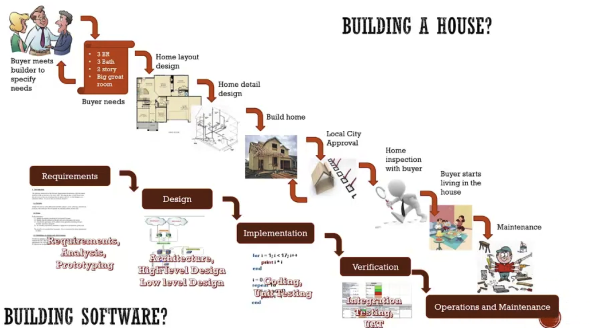
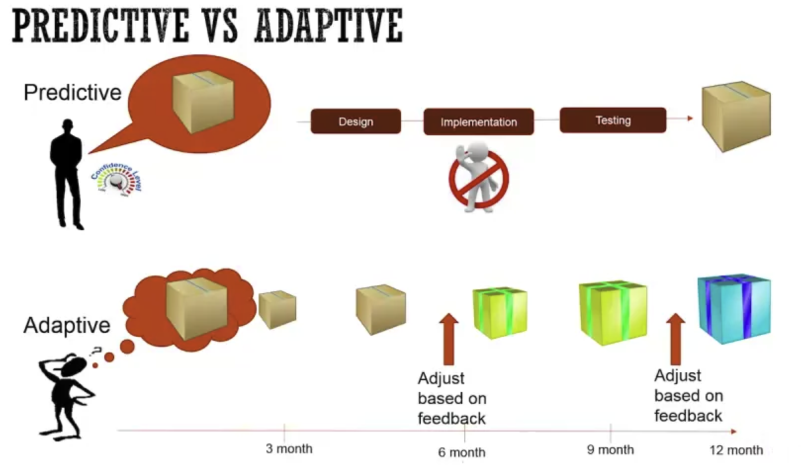
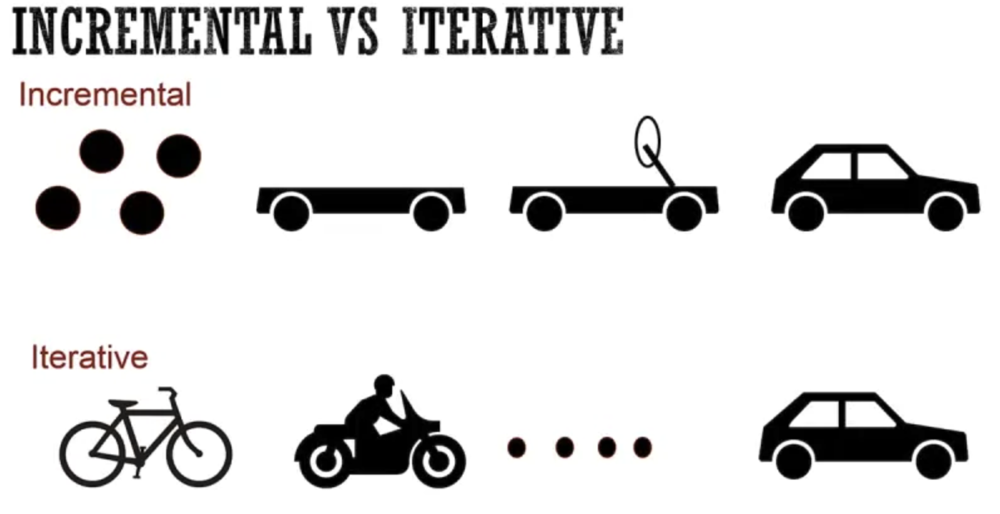
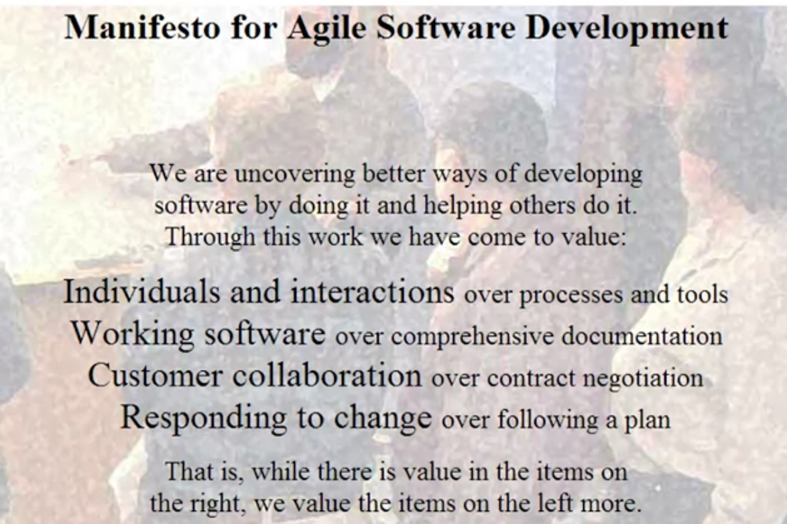
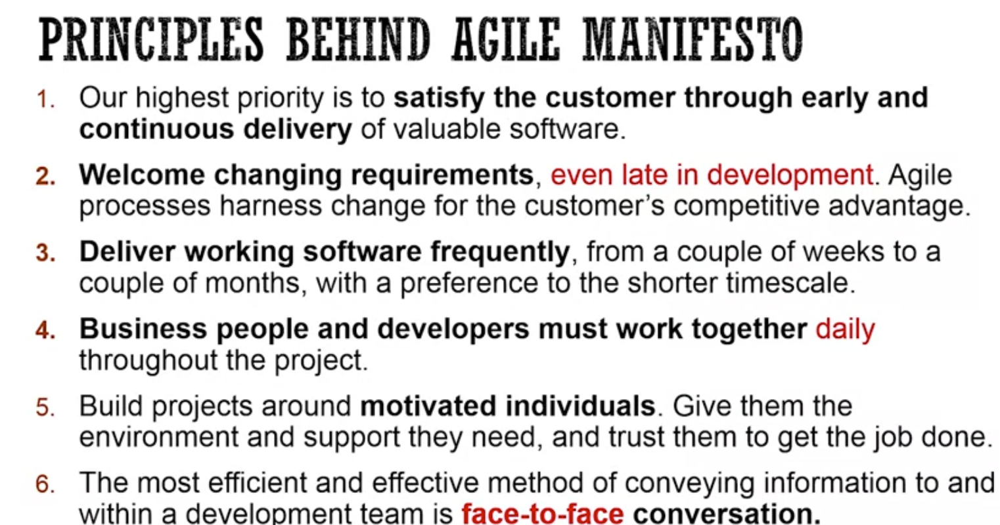
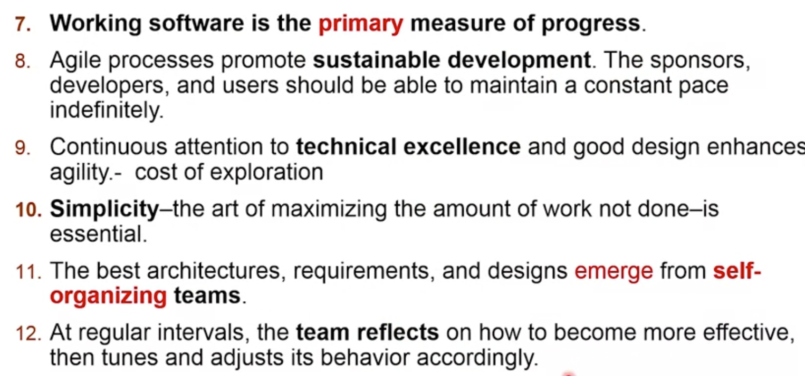
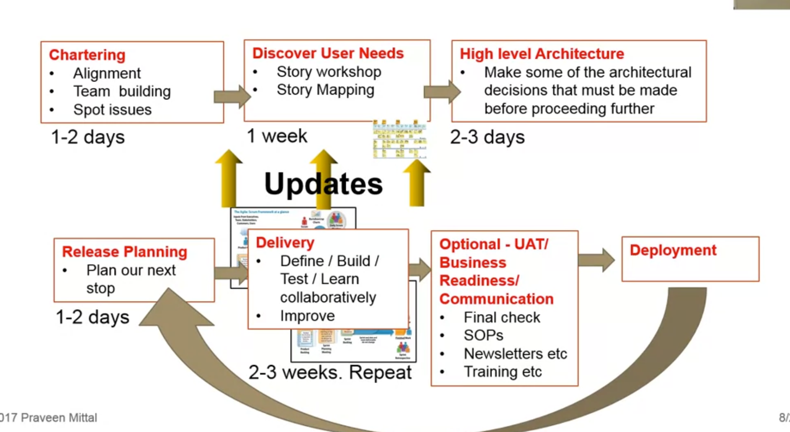

# Agile Software Development

[Coursera Link](https://www.coursera.org/learn/agile-software-development/lecture/i1Psj/welcome-and-course-intro)

---
## Introduction

We can compare Software development with **building a house**.
1. The buyer of the house **specifies their needs** (3 bedrooms, 4 bathrooms, pool, etc.)
2. Based on their needs, the builder is going to come with a **Home Layout Design** (Which de buyer may do some adjustments).
3. Then, the builder is going to make the **home detail design**, which contains the foundations (where the electricity is going to be, the plug distribution, etc.)
4. Start **building** the home.
    - As they are building it, they are going to call the **inspection** people inspect the house when some section is finished (electricity, windows, bedrooms, etc.)
    - Once that is done, the buyer will **approve** everything
5. The buyer will start **Living** in the house
6. The **Maintenance** starts.

In **Software Development**, the **1** are the requirements (what exactly do you need to build). The **2 and 3** are the Design of the entire software (Architecture, High and low level design). The **4** is the actual development, is where the developers start coding. Inside this part, there will be unit testing, which will test each new implementation. The **5** is when the production starts. The buyer will start using the software. Finally, the **6** is the operations and maintenance.
&nbsp;

&nbsp;
This method is called ***waterfall*** method. In here you go from phase to phase. This was a very famous method, but it has a lot of **issues**. When time is passing, the requirements may change, and the market may vary, so it was not as efficient.

Because of this, it came the ***Agile*** Mindset (NOT a method).
The basic idea of this, is that instead of make a big cycle, create a lot of **small cycles**, so you define little, you build, you test, and again and again.

 &nbsp;
  &nbsp;
### Models

There are different models to develop software, which one of them may fit in a particular project.

You can **classify** these methods in different sections.
1. **Predictive vs Adaptive**
    - The **predictive** classification is when the customer knows EXACTLY what he wants to build. In here the cycle is straight. (Design -> Implementation -> Testing). You get the product in one shot, and because the requirements are known in the beginning, there are **NO Changes** during development.
    - The **adaptive** models are useful when the customer does not know exactly what he wants to build. It has an **idea, but not everything**. So in here, they start with an idea. They develop a small version of it, they give it to the customer to have some feedback for the next **update**. In the end, the final product is not what the user **initially expected**, but it is what he really needed.
 &nbsp;
  

2. **Incremental vs Iterative**
   - The **incremental** models you have a fairly good idea of what you want to build, but instead of building it in one shot, you buid in increments. So, if you build a car, you first create the wheels, then the chassis, then the the top, etc.
   - The **iterative** models the costumer does not have a specific idea of what to build, but knows the purpose. So, if the goal is to go from point A to B, you first create a bicycle, then a motorcycle, then a car, and finally a truck. 
   - So the **Main differences** is that in the incremental model you break the product into smaller pieces, while the iterative you build something in top of the past development cycle.
  &nbsp;
    
---

## Agile
  &nbsp;

When using **Predictive** model, we make some assumptions that are often incorrect. 
1. Predict de **requirements** accurately
     - This was not the case. A lot of times the requirements were incorrect, or what they designed was not what the user wanted.
     - When developing, the marketing was changing very fast, so the software was obsolete when it was launched.
2. The **translation** is perfect.
   - When you finish the requirements, you then go to design, then implementation, etc. If the requirements are incorrect, all the previous sections were incorrect as well.

Because of this, companies start using **Agile** methods, like SCRUM, FDD, XP, etc. And they were finding ***SUCCESS***.
The main **purposes** for these methods were:

1. **Reduce the learning cycle** by delivering in short iterations and adapt based on what you learn.
2. **Reduce the cost of change** by making a better collaboration between the sectors.

  &nbsp;
  &nbsp;

### Agile Manifesto
  &nbsp;

#### Agile VALUES

1. **Individual Interactions** over processes and tools
   - This means that usually we try to solve a problem by looking for tools that may help, but it would be better to invest on the interaction between the tools we are using.
2. **Working Software** over comprehensive documentation
   - The documentation will always be useful, but what the client wants is the actual software. For them, the docs does not have much value. (What we want is to have our clients happy and satisfied)
3. **Customer collaboration** over contract negotiation
   - Having a contract is important, but the best way to get what the client needs it to collaborate with it, and go together hand by hand.
4. **Responding to change** over following a plan
   - Plan is needed, but we should NOT say no to change. There will always be change, and we must be ADAPTIVE and AGILE.

***REMEMBER*** We are building what the client **NEEDS**, not what he **Initially wanted**.

&nbsp;

#### Agile PRINCIPLES:

&nbsp;

&nbsp;

1. We need to focus on what the **Customer values the most**, which is a valuable software.
2. Adapt to client needs.
3. Deliver new implementations to the costumer, learn and implement again.
4. Working together is a must in order to understand the project on both sides.
5. **TRUST** in your teammates.
6. Have multiple meetings with the team and the customer.
7. You can create documents, requirements, etc. But the actual software is the main measure of progress.
8. -
9. CODE Standards, clean code, etc.
10. KISS, Keep It Simple. Try not to do useless work.
11. DO NOT try to control everything, let developers organize themselves.
12. Current meetings in development to have a  *reflection* on what they dis and how to improve.

&nbsp;
So, how does this *values* and *principles* solve the **waterfall problems?**
With those, you focus on **adapting** the requirements throughout the development, which helps you detect issues earlier and fix the current software. It also focusses on **collaboration**, which will help you detect translation issues earlier.

But, Agile also brings some **problems**:
Because everything is changing along the way, you will feel a lack of control. Also, the customer will need to spend more time on meetings and on the system.

&nbsp;

---

## Applying Agile Mindset

Agile is ***NOT*** better all the time.
It is not valuable for predictive, repeatable work.

The Agile method is quite simple.

<h3> Plan -> Build -> Learn -> REPEAT </h3>
&nbsp;

**Project agile example**

This is a project example, it is **NOT** the same all the time.

So, you first **Organize** the team. You will start planning on who is going to work on what. Then it comes the **understanding user needs**. You will start discover the requirements the client needs in order to develop the software. After that, you will start the **High level architecture**, on which you DON'T have to make it all, just the main things that has to be done at the beginning.

Once that is done, you will start the cycle. **Release Planning**, you will decide on what we need to focus on this cycle and what are we going to build. Then it comes the **Delivery**, on which we start building it, testing it, and improve it. You will also define the user requirements for the current build. Finally, you **Deploy** it. Once it is done, you will start again with the release planning.

### Agile Frameworks

The most common and used frameworks are:

<h5>SCRUM</h5>
<h5>Kanban</h5>
<h5>Scrumban</h5>
<h5>XP - Extreme</h5>
<h5>Scrum XP</h5>
<h5> Lean Startup</h5>

&nbsp;

---

## Common Terms

### User Stories
- These are a **basic unit of user needs**, which is also known as **requirements** 

---