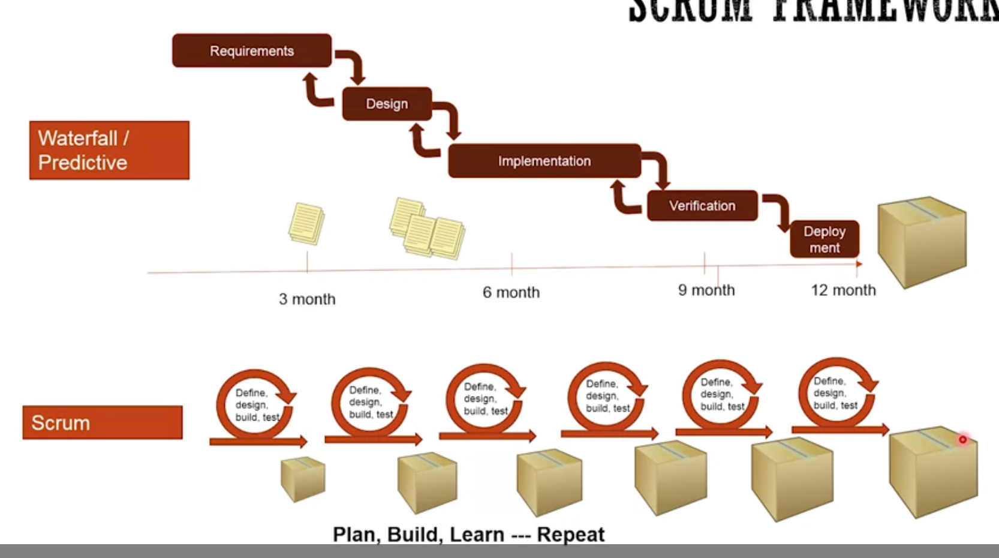
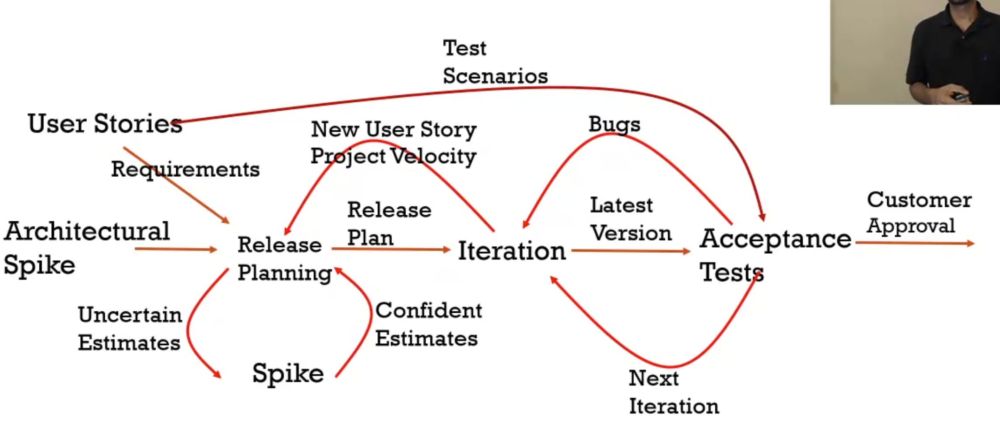

# Agile Software Development

[Coursera Link](https://www.coursera.org/learn/agile-software-development/lecture/i1Psj/welcome-and-course-intro)

---

## Introduction

We can compare Software development with **building a house**.

1. The buyer of the house **specifies their needs** (3 bedrooms, 4 bathrooms, pool, etc.)
2. Based on their needs, the builder is going to come with a **Home Layout Design** (Which de buyer may do some adjustments).
3. Then, the builder is going to make the **home detail design**, which contains the foundations (where the electricity is going to be, the plug distribution, etc.)
4. Start **building** the home.
   - As they are building it, they are going to call the **inspection** people inspect the house when some section is finished (electricity, windows, bedrooms, etc.)
   - Once that is done, the buyer will **approve** everything
5. The buyer will start **Living** in the house
6. The **Maintenance** starts.

In **Software Development**, the **1** are the requirements (what exactly do you need to build). The **2 and 3** are the Design of the entire software (Architecture, High and low level design). The **4** is the actual development, is where the developers start coding. Inside this part, there will be unit testing, which will test each new implementation. The **5** is when the production starts. The buyer will start using the software. Finally, the **6** is the operations and maintenance.
&nbsp;

&nbsp;
This method is called **_waterfall_** method. In here you go from phase to phase. This was a very famous method, but it has a lot of **issues**. When time is passing, the requirements may change, and the market may vary, so it was not as efficient.

Because of this, it came the **_Agile_** Mindset (NOT a method).
The basic idea of this, is that instead of make a big cycle, create a lot of **small cycles**, so you define little, you build, you test, and again and again.

&nbsp;
&nbsp;

### Models

There are different models to develop software, which one of them may fit in a particular project.

You can **classify** these methods in different sections.

1. **Predictive vs Adaptive**

   - The **predictive** classification is when the customer knows EXACTLY what he wants to build. In here the cycle is straight. (Design -> Implementation -> Testing). You get the product in one shot, and because the requirements are known in the beginning, there are **NO Changes** during development.
   - The **adaptive** models are useful when the customer does not know exactly what he wants to build. It has an **idea, but not everything**. So in here, they start with an idea. They develop a small version of it, they give it to the customer to have some feedback for the next **update**. In the end, the final product is not what the user **initially expected**, but it is what he really needed.
     &nbsp;
     

2. **Incremental vs Iterative**
   - The **incremental** models you have a fairly good idea of what you want to build, but instead of building it in one shot, you buid in increments. So, if you build a car, you first create the wheels, then the chassis, then the the top, etc.
   - The **iterative** models the costumer does not have a specific idea of what to build, but knows the purpose. So, if the goal is to go from point A to B, you first create a bicycle, then a motorcycle, then a car, and finally a truck.
   - So the **Main differences** is that in the incremental model you break the product into smaller pieces, while the iterative you build something in top of the past development cycle.
     &nbsp;
     

---

## Agile

&nbsp;

When using **Predictive** model, we make some assumptions that are often incorrect.

1. Predict de **requirements** accurately
   - This was not the case. A lot of times the requirements were incorrect, or what they designed was not what the user wanted.
   - When developing, the marketing was changing very fast, so the software was obsolete when it was launched.
2. The **translation** is perfect.
   - When you finish the requirements, you then go to design, then implementation, etc. If the requirements are incorrect, all the previous sections were incorrect as well.

Because of this, companies start using **Agile** methods, like SCRUM, FDD, XP, etc. And they were finding **_SUCCESS_**.
The main **purposes** for these methods were:

1. **Reduce the learning cycle** by delivering in short iterations and adapt based on what you learn.
2. **Reduce the cost of change** by making a better collaboration between the sectors.

&nbsp;
&nbsp;

### Agile Manifesto

&nbsp;

#### Agile VALUES

1. **Individual Interactions** over processes and tools
   - This means that usually we try to solve a problem by looking for tools that may help, but it would be better to invest on the interaction between the tools we are using.
2. **Working Software** over comprehensive documentation
   - The documentation will always be useful, but what the client wants is the actual software. For them, the docs does not have much value. (What we want is to have our clients happy and satisfied)
3. **Customer collaboration** over contract negotiation
   - Having a contract is important, but the best way to get what the client needs it to collaborate with it, and go together hand by hand.
4. **Responding to change** over following a plan
   - Plan is needed, but we should NOT say no to change. There will always be change, and we must be ADAPTIVE and AGILE.

**_REMEMBER_** We are building what the client **NEEDS**, not what he **Initially wanted**.

&nbsp;

#### Agile PRINCIPLES:

&nbsp;

&nbsp;

1. We need to focus on what the **Customer values the most**, which is a valuable software.
2. Adapt to client needs.
3. Deliver new implementations to the costumer, learn and implement again.
4. Working together is a must in order to understand the project on both sides.
5. **TRUST** in your teammates.
6. Have multiple meetings with the team and the customer.
7. You can create documents, requirements, etc. But the actual software is the main measure of progress.
8. -
9. CODE Standards, clean code, etc.
10. KISS, Keep It Simple. Try not to do useless work.
11. DO NOT try to control everything, let developers organize themselves.
12. Current meetings in development to have a _reflection_ on what they dis and how to improve.

&nbsp;
So, how does this _values_ and _principles_ solve the **waterfall problems?**
With those, you focus on **adapting** the requirements throughout the development, which helps you detect issues earlier and fix the current software. It also focusses on **collaboration**, which will help you detect translation issues earlier.

But, Agile also brings some **problems**:
Because everything is changing along the way, you will feel a lack of control. Also, the customer will need to spend more time on meetings and on the system.

&nbsp;

---

## Applying Agile Mindset

Agile is **_NOT_** better all the time.
It is not valuable for predictive, repeatable work.

The Agile method is quite simple.

<h3> Plan -> Build -> Learn -> REPEAT </h3>
&nbsp;

**Project agile example**

This is a project example, it is **NOT** the same all the time.

So, you first **Organize** the team. You will start planning on who is going to work on what. Then it comes the **understanding user needs**. You will start discover the requirements the client needs in order to develop the software. After that, you will start the **High level architecture**, on which you DON'T have to make it all, just the main things that has to be done at the beginning.

Once that is done, you will start the cycle. **Release Planning**, you will decide on what we need to focus on this cycle and what are we going to build. Then it comes the **Delivery**, on which we start building it, testing it, and improve it. You will also define the user requirements for the current build. Finally, you **Deploy** it. Once it is done, you will start again with the release planning.

### Agile Frameworks

The most common and used frameworks are:

<h5>SCRUM</h5>
<h5>Kanban</h5>
<h5>Scrumban</h5>
<h5>XP - Extreme</h5>
<h5>Scrum XP</h5>
<h5> Lean Startup</h5>

&nbsp;

---

## User Stories and Requirements Gathering

&nbsp;

### Gathering Requirements

Usually Clients **DO NOT** have any idea what they really want, but the know what they **NEED**.

So, in this process we need to help the client what it needs to take there.

When specifying the **requirements with documents**, the client, the developers and the business group will understand it in a very different way. Because of this, in Agile is recommend it to have the documents that are **Just enough - just in time**.

#### Story Process

1. **Card**: The client will specify the requirements in a high level functionality of what they want.
2. **Conversation**: We will pick one card and build its functionality. The dev and business teams gather up to clearly understand what they need. We specify what is going to do, and how is it going to look like.
3. **Confirmation**: Both teams will write down what they agreed upon.

In Agile is allowed to change the requirements over time. This will change what the user wanted, but not what it needed.

&nbsp;

### User Stories

&nbsp;

There are some **Templates** to gather the User Stories:

&nbsp;

&nbsp;

Once you have the Who, What and why, you will also need to write the **Acceptance test**

In order to do that, you will need to see it in this different ways:

- What the **client** will check to validate that it is done.
- What will we **test to confirm** that is done?
- How will we **demonstrate** this software at a product review?

In the _test to confirm_, you need to specify the success and failure paths.

You need to explain **WHAT** this card can do, not the **HOW**.
Ex:

- what: The customer can see the details of the movie. :)
- how: The costumer can click on the right-top side of hte screen to see the details screen. :(

By doing the acceptance test, it will **help you** think through the entire card process, build a common understanding throughout the entire teams, the team response time will improve, end more.

&nbsp;

#### SPIKES

This is also a user stories. They are needed when we need to do some **research** about a tool, software, etc.
These have a specified **limit time**, and will **NOT** be part of production mode, only for research and knowledge gathering.

&nbsp;

#### Good User Stories characteristics

A User Story can follow the **INVEST** guideline.

- **I**ndependent: When we are working on one, they must be independent from another story. It does not depend on another one.
- **N**egotiable: We must leave some details at the end. We do not have to specify all the requirements or the process at the beginning. It can also change through time.
- **V**aluable: It must be useful to the user.
- **E**stimate.
- **S**mall.
- **T**estable: Validate that it is actually done somehow.

User Stories **DO NOT** have to have all these guidelines (it is impossible), but they can try to have them.
Don't let it come in the way of building right stuff effectively.

&nbsp;

#### Generating User Stories

There are **two** techniques to generate user stories, which are **User Story Writing Workshop** ad **Story Mapping**.

&nbsp;

##### User Story Writing Workshop

**Goal:** Write as many stories as you can for the selected theme

**Who**: The product owner, other stakeholders who knows the user needs, the SCRUM Master and the Dev team.

**How Long**: Few Hours To few days.

The first thing you need to do is to **identify the Users** in the project. Then, you will think on the **functionalities** each user should have in the theme. You start going from the top user stories to bottom (main to specific functionalities)

Once that is done, you will start creating the **Product Backlog** (Ordered list of everything that the product needs. it is ordered by priority).

To have a **GOOD Product Backlog**, it must be:

- Detailed Appropriately: You must specify what is going to be done, NOT what is going to doing to do in the future.
- Emergent: Always evolving in terms of user needs and details.
- Estimated: Predict your plan or releases.
- Prioritized: Items inside the backlog must have a priority in order to know which one is more important than the other, and which one needs another item to be finished.

&nbsp;

##### Story Mapping

STRUCTURE:

So, from left to right is chronological, and from top to bottom is priorities.

&nbsp;

EXAMPLE:

**STEPS:**

1. Frame the problem: Understand what is the problem and what benefit the software can bring to the organization.
2. Activities: You outline what activities the user will do. You will start creating the UserStories, and will arrange it in the timeline.
3. User Tasks: With the main activities in the step below, you will create the tasks. These are the steps that a user is going to take to do those activities.
4. Variations: You will start to overlap the tasks vertically if the user can do several tasks at a time.
   - So, the vertical alignment means an OR. "The user can enter their email OR enter the password".
   - The horizontal alignment means an AND THEN. "The user Will log in, THEN he will create a product, THEN specify..."
5. Slice out viable releases: You select the stories that are the most meaningful to the initial release.

&nbsp;

---

## Agile Estimation and Planning

### Agile Planning

There are four main concepts to consider:

1. Multi-level: First you do the Release planning, then the Iteration planning, and then the daily planning.
2. Less Upfront but frequent: We DON'T do a specific planning at the beginning, but we do more plannings throughout the project.
3. Just enough, just in time: Do the task you need to complete the specific story.
4. Adapt and re-plan: While the process, you can re-plan the main plan.

So, this is how the process is:

First it comes the **Vision/Strategy**, which we need to know the product vision and what we want to build. Then comes the **Product Backlog/Story Mapping**, which contains the ranked list of stories that we need to build. With those, you specify which ones has to be in the release. This is the **Release Planning**. Once that is done, we break those releases in Sprints. We specify the User Stories that will be on each sprint (**Sprint Planning**). Finally, on each sprint, we do the **Daily standups**. In here, we create the tasks for each user story, and assign it on an everyday work.

&nbsp;

### Agile Estimation

There are three main concepts:

1. **Effort vs. Duration**:
   - If you ask a full-time dev to build a web screen and told you that it will take 3 days to build it, it may refer to work work 8 hours for 3 days in order to achieve it.
   - So, the **Duration** will be 3 days, but the **effort** will be 1 day.
   - A common term used is an **Ideal day**, which means how many work days it will take you to complete a story if you work UNinterrupted (This is one way on how we estimate the stories.)
   - We **PREFER EFFORT** over Duration
2. **Accuracy vs. Precision**:
   - Precision: A dev can tell me the specific ideal days to finish each task (Task1: 1.2 ID, Task 2: 1.8 ID)
   - Accuracy: A dev can tell me a rough idea for how long it can take to finish all the tasks, and separate them on **BUCKETS**. These are a "schedule" on when it can deliver the tasks. We can use IDs to do it. (Task 1 and 2 in 1 ID, Tasks 3 and for in 3 IDs, etc..) If you wave less buckets, it will be a faster estimation, but it will be less precise.
   - The buckets can be on different scales. We can go from binary (Bucket 1: 1 day, B2: 2 days, B3: 4 days, B4: 8 days). So, the dev can specify the bucket on each task.
   - If you DON'T know how long is it going to take, you add it as a ? instead of a specific time
   - We **PREFER Accuracy** over Precision
3. **Relative vs. Absolute**:
   - Relative Sizing: If a StoryA is 1 point, then the StoryB is 3 points, because it is bigger, and I am estimating Based on what I have calculated before.
   - Absolute Sizing: StoryA will take 1 day, StoryB will take 2 days.
   - Relative uses **POINTS**, while absolute uses **Ideal Day Buckets**
     

&nbsp;

### Estimation Styles and process

The main idea is to **involve** the whole dev team into the estimation so that everyone gets an idea of what to build.

There are 3 main estimation styles:

- **Simple - free form**: Is very simple. You go on each item from the product backlog and specify how long is it going to take.
- **Planning poker**:

  - The main idea is that everybody will get one card for each bucket. The PO will explain the story so everybody understands it. Once that is done, everybody will put the card they think it is going to take to solve that story. If someone doesn't agree, we will start the explanation again until everybody puts the same bucket, and move on to the next story.

- **Card sorting**:
  - First, you pick the smallest and largest story and place it in the top corners. Then, with NO discussion, SILENTLY, all the group will start arranging all the stories based on their size.
  - IF there are cards with questions, or someone placed a story and you disagree with his decision, you will place those cards outside the board.
  - With those cards, everybody will discuss about them and place them together.
  - Finally, everybody will take another look and discuss about disagreements.
  - After the board is finished, we will create the buckets and their size depending on the stories.

&nbsp;

### Velocity

Velocity in agile is the amount of **work done** in a **sprint**.
It **depends** on many factors, such as the team, the project, etc.

There are different methods to **calculate the velocity**:

To calculate a finished sprint velocity is simple. You add the total points achieved, and that's it.

To calculate **future sprints**:

- Use the las sprint velocity
- Get an average of all the past sprints
- Get a range of the last X sprints.

How to calculate the **first sprint**:

&nbsp;

### Release Planning

There are 2 types of release planning:

1. **Fixed Scope**: How long will it take?
2. **Fixed Date**: What can we deliver?

#### Fixed Scope

In order to calculate the Fixed Scope, you need to have all the stories you need for the Release 1.
Steps:

1. Decide the **sprint length**
2. Calculate the **velocity**
3. Sum all the **estimate time** for the selected stories
4. Divide the estimate time by the velocity. That will give you the **number of sprints**
5. Finally, multiply the number of sprints with the sprint length. That will give you the **duration**

**EXAMPLE**:

##### How to select the stories for the Release #1?

Use the story map (if you have) and craft the release so it can be **usable** by the user.
In agile we focus on continuous delivery, so we need a **short feedback loop**. So, we need to only keep the stories that are important for achieving the outcome of our release.
How do You should consider what to consider on selecting a release? It depends on these points:

&nbsp;

#### Fixed Date

1. Groom backlog: You need to know what stories have the highest and lowest priorities.
2. Calculate velocity.
3. Have the sprint length
4. Calculate number of sprints
5. Calculate Release Capacity: (#Sprints \* Velocity).
6. With that, include the items from the backlog until almost gets to the points we have calculated.

In case of using **velocity range**, you will do the step 5 with the lowest and highest velocity. So that in the 6th step you calculate the items until exceeds the lowest velocity range.

EXAMPLE:

&nbsp;

### Release Tracking

The release tracking will help you know if we are on track for a particular release.

There are three methods:

1. **Release Burn Up**:
   
   So this method will give you some idea if you are in track or not. It is also used to remove some work in order to meet the deadline.
   &nbsp;
2. **Story Board**:
   
   &nbsp;
3. **Cumulative Flow**:
   
   This is like an extension for the Release burn up. But in addition, we add the cumulative of different status of the story.
   &nbsp;

&nbsp;

---

## SCRUM

### SCRUM Overview

So SCRUM works in a 1-4 week sprint where you take part if your product, and you define, you design, you build, and you test. This is the main cycle. You will repeat again and again until you have the final product.

 

&nbsp;

#### Process:

In order to start, you will need to **define 3 personas**. The **Product Owner**, who defines what needs to be done and at what order. **The SCRUM Master**, which helps the team stay true to the SCRUM values and principles and facilitates most of the meetings in the team. And finally **the team**.

The product owner will **get input** from the client, stakeholders, customers, etc. and will try to define what exactly needs to be built. With this, he will create the **product backlog** (A list of requirements ordered by priority.) The difference between a Product backlog and a **requirements list** is that the backlog is at a high level and can change over time.

With this it will start the **Sprint Planning Meeting**. In here, the whole team comes together, and they pick the user stories that they can work on in the existing sprint. The PO reviews that stories with the team and clarifies what needs to be done.

Then the team gets together again and then does a tasking out of the stories. **This is a Sprint Backlog**. In here the team basically will gain **confidence** by understanding specifically what needs to be done to complete that user story.

The **sprint will start**. Everybody is working to implement the software. During the sprint the whole team gets together for a **Daily Scrum Meeting**, in which everybody will talk about what they did yesterday, what are they going to do today, and if there are any roadblocks. To **keep track** of the sprint, we can use rather a burn up or a burn down chart.

At the end of the sprint you will have a **finished product**. There are two other meetings at the end. The first one is the **Sprint Review**. The whole team gets together with the stakeholders and the client and will demonstrate the work they have done and get feedback. The other one is the **Sprint Retrospective**. In here we talk about the process, not the product. We talk about what went well, what did not went well and how can we improve it.

#### Process Summary:

1. Product Owner understands what needs to be done by the input of the Client, Stakeholders, etc.
2. Product Owner will create the Product Backlog.
3. BEGIN CYCLE: Sprint Planning Meeting
4. Sprint Backlog
5. DURING SPRINT: Daily Scrum Meeting and Track Progress.
6. SPRINT FINISHED: Sprint Review and Sprint Retrospective

&nbsp;

### Sprint Tracking and Planning

In this section we **focus on** the Sprint Planning Meeting, Sprint Backlog, and the Burn down/up charts to track progress.

**_BEFORE_** the Sprint Planning, you need to do the Backlog Grooming. This is basically updating the Backlog based on these tips:

- **Removing** user stories that no longer appear relevant.
- Creating **new user stories** in response to newly discovered needs.
- Re-assessing the relative **priority** of stories
- Assigning **estimates** to stories which have yet to receive one.
- Correcting **estimates** in light of newly discovered information.
- **Splitting** user stories which are high priority but too coarse grained to fit in an upcoming sprint.

Once this is done, it is time to **Select and prepare Stories**.

- How do you select **potential stories**?
  - Story Map
  - Prioritized backlog and velocity
  - Alternatives:
    - Theme?
    - anything team wants to learn?
- Make sure **stories are ready** to be worked upon (why, what why, acceptance tests, and major dependencies).

Now, the **Sprint Planning Begins.**
There are two possible ways:

- One step: Select one story at a time, task it out until capacity reached.
- Two step:
  1. Select stories based on velocity
  2. Task out and gain confidence.

#### Sprint Planning Steps

1. Determine **Sprint capacity**.
   &nbsp;
   
   &nbsp;
   &nbsp;
2. Review Sprint **Goal** (if any)

   - At the end of sprint X, persona will be able to do xyz...
   - Something that the team can rally around.
     &nbsp;

3. Review **Potential Stories**

   - PO goes through selected stories
   - TIP: Elicit feedback. People not asking questions is generally a bad sign.
   - TIP: Setup a "definition of ready" for stories
     &nbsp;

4. Acquire **Confidence**: Design Discussion and **Task out** stories
   - Not everybody has to stick around.
   - Face-to-face conversation helps
   - TIP: Time box activity/discussions
   - TIP: Estimate tasks in ideal days/hours
     &nbsp;
5. **Refine** sprint goals if required
   &nbsp;
6. Make **Commitment**
   &nbsp;
7. Put the stories and tasks on the **task wall**
   &nbsp;

#### Sprint Tracking

There are 3 methods to track te current sprint:

1. **Burn down**: you calculate the amount of work LEFT.
   &nbsp;
   
   &nbsp;
   &nbsp;
2. **Burn up**: The amount of work DONE and the total work TODO:
   &nbsp;
   
   &nbsp;
   &nbsp;
3. **Task board**: A visual way to see wether you are on track or not.
   &nbsp;
   
   &nbsp;
   &nbsp;

### Sprint Review, Retrospective and Sprint Execution

#### Sprint Execution

- It is recommended that devs **pick the stories** from the board rather than assigning to them (Choose inside the priority cards).

- You DO NOT want **too much work weight** on a single person or too many things going on at the same time.

- **Parallel work vs. Swarming**: Parallel means to work on a few stories at a time, while Swarming means to **focus** on a specific story (the whole team)

- **Generalists vs Specialists**: In order to make Swarming work, you need generalists instead of specialists. This means that you need to have a person, group that **together** can make the whole story (UI, front, back, etc.). With this, you can **work with swarming**.
- **Discipline**: Whatever the team decided, we all must follow those rules and working agreements.
- **Engineering practices**: continuos integration, automated deployment,etc. (engineering practices)

&nbsp;

#### Daily Standups

- **What**
  - Team members answer **three questions**
    - What I did yesterday?
    - What I am going to do today?
    - Roadblocks?
  - **ALTERNATIVE**:
    - Work items Attend / Story Focused stand-up: In here you look at the board, pick the first story and the one working n that talks about it.
- **Who**: The Core team and any stakeholder wo wants to attend.
- **Purpose**:
  - Daily team planning
  - Collaborate
  - Identify Blockers
  - Status Check?
- **Tips**:
  - Show the board
  - Parking lot: if a discussion is taking to long, you pause it, finish the standup and continue with him after.
  - Keep it short

&nbsp;

#### Sprint Review

- **Purpose**:
  - Review work done and learnings' from the sprint.
  - Get feedback and adjust future direction
  - Celebrate
- **Who**:
  - Core team
  - Stakeholders
  - Anybody and everybody
- **How long?**:
  - 1-2 hours
- **What Happens?**:
  - Summarize
  - Demo
  - Discuss
  - Adapt
- **TIPS**:
  - Don't wait for review to show your work
    - If you finish something earlier, you can show it to the Product Owner, the client, etc. to get the feedback.
  - Demo done things only (OPTIONAL)
  - Make effort to get stakeholders to attend:
    - This will make them know your commitment of what you are delivering
  - Presentations by individuals:
    - Try to make the presentations with all the people that developed it. Each one of them will show their work.
  - Prepare the work:
    - Get the demo and presentation ready before the meeting, but do not take too long to do it.

&nbsp;

#### Sprint Retrospective

It may be the **most important** part of SCRUM.
No matter how much you prepare the sprint, you cannot get your process right the first time. So you always want to make sure that you are **constantly improving** your process.

- **Who**: Core team (NOT STAKEHOLDERS)
- **When**: At the end of the sprint
- **Purpose**: Continuous improvement
- **What** happens:

  - What is working?
  - What is NOT working?
  - Action Items?
  - The common way is to use a three column board, in which everyone add cards based on their opinion:
    
    Then, we will make a discussion on each card.
    &nbsp;

  - ALTERNATIVE: **Focused Retro**
    
    &nbsp;

  - **TIPS:**
    

&nbsp;

---

## XP

### XP Overview

XP Stands for e**X**treme **P**rogramming.

"Is something is good, why don't we take it to the extreme?"

XP is all about engineering practices, giving up old habits, lightweight and very adaptive.

It sounds very good, but since it took everything to an extreme, it ran into some controversy: Pair programmings, prescriptive, incremental design, scalability, and others.

&nbsp;

### XP Values

The XP Values are:

- **Simplicity**:
  - We will do only the necessary.
  - What is the simplest thing that could possibly work?
- **Communication**:
  - Everyone should communicate face to face daily
  - Work together on everything
  - Create a sense of team
- **Courage**:
  - Tell the truth about the process
  - Don't document excuses for failure
  - Adapt to changes
- **Feedback**:
  - Getting as much feedback as team can handle
  - Get feedback to iterate and improve.
  - Slow down feedback if you can't adapt.
  - Feedback comes in many forms
- **Respect**:
  - I am important, and so are you

&nbsp;

### XP Practices

1. **Sit together**:
   - Open working and highly collaborative environment:
   - XP Recommends the team to all sit together, which means tear down the walls between the cubicles, bring the hole team together to a common area or a common room for collaboration.
2. **Whole Team**:
   - Everyone needed for project success is part of the team.
   - Team composition is Dynamic
3. **Informative Workspace**:
   - Build your workspace so that if anyone comes there, they will get an idea of what is going on in 15 seconds.
   - Dynamic information: Keep the workspace information up -to-date.
   - keep it clean
4. **Energized Work**
   - Working hours - productive: Don't burn down the team by making them work more than they can, and don't spoil the future work.
   - Sick? Stay out, rest and get well.
   - Incremental improvement
5. **Pair Programming**:
   - Two people working together
   - Work alone only when needed.
   - This will help you keep each other on task, brainstorm refinements, clarify ideas, take initiative if parent is stuck, hold each other accountable to the team's practices.
6. **Stories**:

- Unit of functionality.
- They are flexible
- Estimate early
- Keep them visible

7. **Weekly Cycle**:
   - Plan weekly.
     - Review progress
     - Select week's worth work
     - Break Stories into tasks
   - Gradually reduce planning time
   - Task ownership
8. **Quarterly Cycle**:
   - Plan work quarter at a time
9. **Slack**:
   - Build some slack into the process.
     - Lower priority tasks that can be skipped
     - One week every 8th week as geek week
     - 20% time for programmer-chosen tasks
10. **Ten minute build**
    - Build and run the tests with in 10 minutes.
    - New to agile
      - Automated build
      - continue to evolve
    - Gives confidence and reduces stress
11. **Continuous integration**
    - Integrate and test changes after no more than a couple of hours.
    - Asynchronous integrations
    - Synchronous integrations
12. **Test first functionality**:

- Write test -> Run tests to see it fail -> Write code -> Until test pass.
- Benefits:
  - Avoid sScope creep
  - Build Trust in team members
  - Reduce Coupling.

13. **Incremental Design**:
    - Invest a little in design everyday
    - Excess complexity -> Refactor
    - Architecture emerges over time

&nbsp;

### XP Process Model

XP process starts with release planning. In here you plan next release, which means selecting what team will deliver as part of the next release.

&nbsp;

---
