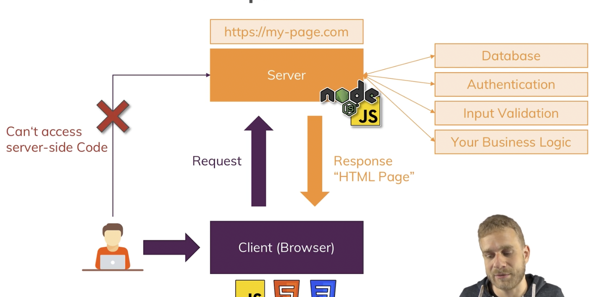

<h1> NodeJS - The Complete Guide (MVC, REST APIs, GraphQL, Deno)</h1>

[Udemy Course](https://www.udemy.com/course/nodejs-the-complete-guide/)

---

# Introduction

## What is Node JS

Node JS is a JavaScript Runtime. It is a JavaScript environment that runs JavaScript code outside of the browser.

How? By using the V8 Engine. This is an engine created by Google in order to support JS inside Google Chrome.

&nbsp;

## Understanding the Role & Usage of Node.js

When the user asks for a **website**, the browser asks the server for the website. This is a request. What the server does is it sends the website **back to the user**.



This is one of many functions of a **server**.
This is what we are going to use Node. We are going to use it to **write code** that will be run on the server and **create** the server itself.

Node is also useful to do other things. Because is a **JavaScript Runtime**, you can run JS on your computer, so you can do Utility Scripts, Build Tools, etc.

&nbsp;

---

# Understanding the basics.

## Creating a Node Server

In order to create a local server, we need to use the **`require`** function and call the **`http`** module.

```js
const http = require("http");

http
  .createServer((req, res) => {
    res.writeHead(200, { "Content-Type": "text/plain" });
    res.end("Hello World\n");
  })
  .listen(3000);
```

This will Create a server on **port 3000**, and will send the message "Hello World" to the user.

&nbsp;

## The Node Lifecycle & Event Loop

When you start running the server, Node will start something called the **Event Loop**. This is a loop that runs forever as long as there are event listeners registered. The one we did before, it an event listener at **port 3000**. So as long as that port is open, the event loop will run.

&nbsp;

&nbsp;

---
